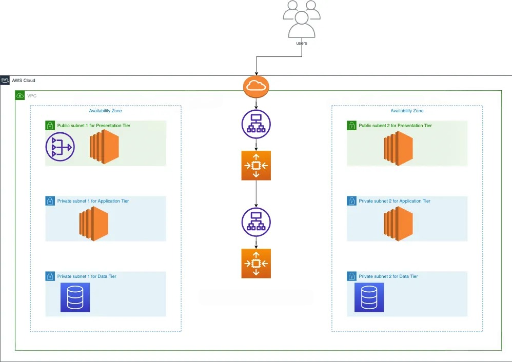
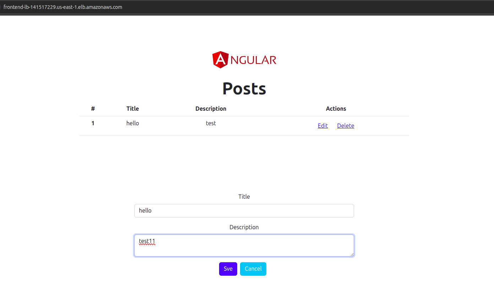
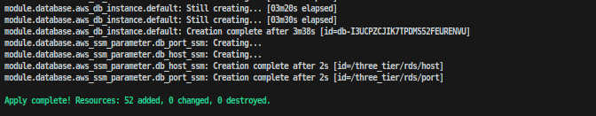
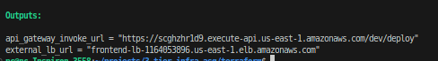
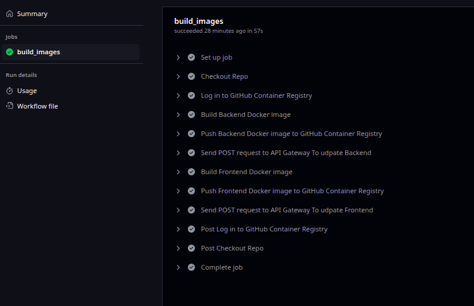
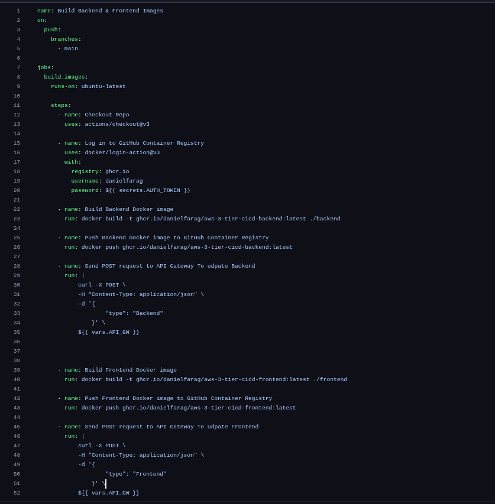
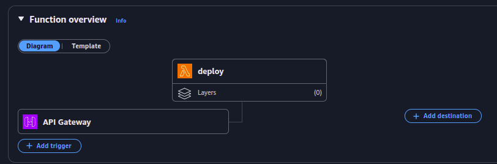
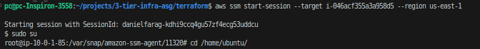
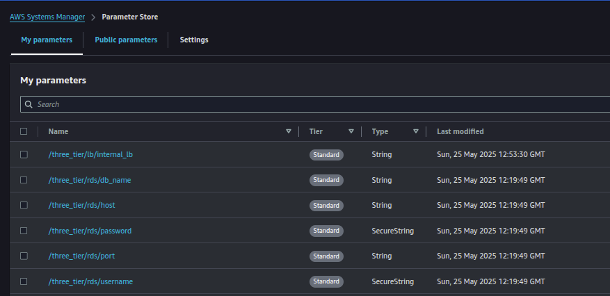

# 3-Tier Infrastructure with CI/CD on AWS

This project implements a scalable, secure, and automated 3-tier web application architecture on Amazon Web Services (AWS) using Terraform for infrastructure provisioning and GitHub Actions for a robust CI/CD pipeline. AWS Systems Manager (SSM) is leveraged extensively for configuration management, secure secret storage (including database credentials), and dynamic updates of backend and frontend services on EC2 instances.


## Table of Contents

1.  [Architecture Overview](https://github.com/danielfarag/aws-3-tier-cicd?tab=readme-ov-file#1-architecture-overview)
2.  [Features](https://github.com/danielfarag/aws-3-tier-cicd?tab=readme-ov-file#2-features)
3.  [Project Structure](https://github.com/danielfarag/aws-3-tier-cicd?tab=readme-ov-file#3-project-structure)
4.  [Prerequisites](https://github.com/danielfarag/aws-3-tier-cicd?tab=readme-ov-file#4-prerequisites)
5.  [Deployment Guide](https://github.com/danielfarag/aws-3-tier-cicd?tab=readme-ov-file#5-deployment-guide)
      * [AWS Configuration](https://www.google.com/search?q=#51-aws-configuration)
      * [Terraform Deployment](https://www.google.com/search?q=#52-terraform-deployment)
      * [GitHub Actions Setup](https://www.google.com/search?q=#53-github-actions-setup)
6.  [CI/CD Pipeline Workflow](https://github.com/danielfarag/aws-3-tier-cicd?tab=readme-ov-file#6-cicd-pipeline-workflow)
7.  [SSM Management and Updates](https://github.com/danielfarag/aws-3-tier-cicd?tab=readme-ov-file#7-ssm-management-and-updates)
8.  [Security Considerations](https://github.com/danielfarag/aws-3-tier-cicd?tab=readme-ov-file#8-security-considerations)

-----

## 1\. Architecture Overview

The solution deploys a classic 3-tier web application architecture on AWS, designed for scalability, security, and automated deployments:

  * **Presentation Layer (Frontend):** Comprises EC2 instances within a **public subnet**, distributing traffic via an **Application Load Balancer (ALB)**. These instances serve the Angular application to end-users.
  * **Application Layer (Backend):** Consists of EC2 instances within a **private subnet**, receiving requests from an **internal ALB**. This layer hosts the Node.js application, handling business logic and communicating with the database.
  * **Data Layer (Database):** An **Amazon RDS instance (MySQL)** deployed in **private subnets** for enhanced security and managed database capabilities (backups, patching, scaling).
  * **Networking:** A custom **Virtual Private Cloud (VPC)** with logically isolated **public and private subnets**, an **Internet Gateway (IGW)** for public subnet outbound internet access, and **NAT Gateways** within public subnets to enable outbound internet access for resources in private subnets.
  * **Scalability:** Both Frontend and Backend layers are configured with **Auto Scaling Groups (ASG)** to dynamically adjust capacity based on demand, ensuring high availability.
  * **Management & Configuration:** **AWS Systems Manager (SSM)** is extensively used for runtime configuration, secure secret storage (Parameter Store), and command execution (Run Command) on managed EC2 instances.
  * **CI/CD:** A **GitHub Actions** pipeline automates the build, push, and deployment triggering process using **AWS Lambda** and **API Gateway**.




-----

## 2\. Features

  * **Infrastructure as Code (IaC):** All AWS infrastructure is provisioned and managed using Terraform, ensuring consistent and repeatable deployments.
  * **Scalable 3-Tier Design:** Implements a robust 3-tier architecture with distinct presentation, application, and data layers. Each tier utilizes Auto Scaling Groups for elasticity and high availability.
  * **Secure Networking:** A custom VPC is set up with public and private subnets, granular Security Groups, and Network Access Control Lists (NACLs) to enforce robust network isolation and traffic control.
  * **Managed Relational Database:** Utilizes Amazon RDS for MySQL, offering a fully managed, scalable, and highly available database solution with automated backups and patching.
  * **Centralized & Secure Configuration (SSM Parameter Store):** **Sensitive database credentials (username, password, endpoint, DB name, port) and other shared application configuration data are securely stored as `SecureString` types within AWS Systems Manager Parameter Store.** This eliminates the need to hardcode secrets in code or configuration files, enhancing security.
  * **Automated Deployment & Configuration (SSM Run Command):** Frontend and Backend updates are triggered via SSM Run Command, allowing dynamic pulling of new Docker images and container restarts on target instances.
  * **Containerized Applications:** Both the Frontend (Angular) and Backend (Node.js) applications are containerized using Docker, promoting portability and consistent environments.
  * **CI/CD Pipeline:** A comprehensive CI/CD pipeline built with GitHub Actions:
      * **Continuous Integration:** Automatically builds and pushes Docker images to GitHub Container Registry (`ghcr.io`).
      * **Automated Deployment Trigger:** An HTTP POST request to an API Gateway endpoint triggers a Lambda function.
      * **Lambda Orchestrator:** The Lambda function acts as a deployment orchestrator, using `boto3` to dynamically identify target EC2 instances (based on tags like `Frontend` or `Backend`) and execute SSM Run Commands for updates.

-----

## 3\. Project Structure

The repository is meticulously organized to separate infrastructure (Terraform) from application code and CI/CD workflows, ensuring clarity and maintainability.

```
.
├── .github/                  # GitHub Actions Workflows - Main CI/CD pipeline workflow
├── backend/                  # Node.js Backend Application Source Code
├── frontend/                 # Angular Frontend Application Source Code
└── terraform/                # Terraform Infrastructure as Code
    ├── auto-scaling/         # Auto Scaling Groups, Launch Templates, IAM Roles for EC2
    │   ├── backend.sh        # User data script for backend instances (container update logic)
    │   ├── frontend.sh       # User data script for frontend instances (container update logic)
    │   ├── output.tf
    │   ├── roles.tf          # IAM roles for EC2 instances (SSM access)
    │   ├── scaling_groups.tf # ASG definitions
    │   └── templates.tf      # Launch template definitions
    ├── backend.tf            # Terraform backend configuration (e.g., S3 for state locking)
    ├── database/             # RDS Instance, DB Subnet Group, Parameter Group
    │   ├── main.tf           # RDS instance definition
    │   ├── output.tf
    │   ├── store.tf          # SSM Parameter Store definitions for DB credentials/endpoint
    │   └── variables.tf
    ├── data.tf               # Terraform data sources (e.g., fetching latest AMI)
    ├── lambda/               # AWS Lambda Function for Deployment Orchestration
    │   ├── deploy.py         # Lambda function code (Python)
    │   ├── function.tf       # Lambda function definition, IAM role, API Gateway integration
    │   ├── lambda_function.zip # Zipped Lambda code (generated by Terraform's archive_file)
    │   └── variables.tf
    ├── load-balancer/        # Application Load Balancers (ALBs), Target Groups, Listeners
    │   ├── backend.tf        # Internal ALB for Backend
    │   ├── frontend.tf       # External ALB for Frontend
    │   ├── output.tf
    │   └── variables.tf
    ├── main.tf               # Main entry point for global Terraform resources
    ├── network/              # VPC, Subnets, Route Tables, Internet Gateway, NAT Gateway
    ├── providers.tf          # AWS provider configuration
    ├── security_groups/      # All Security Group definitions for various components
    ├── variables.tf          # Global Terraform input variables
    └── vars.tfvars           # Default variable values (for local development/testing)
```

-----

## 4\. Prerequisites

Before deploying this comprehensive project, ensure you have the following tools and configurations in place:

  * **AWS Account:** With administrative access to create and manage AWS resources.
  * **AWS CLI:** Installed and configured with appropriate credentials and a default region.
  * **Terraform:** v1.0.0 or higher installed on your local machine.
  * **GitHub Account:** To host the repository and leverage GitHub Actions for CI/CD.
  * **GitHub Personal Access Token (PAT):**
      * Generate a PAT with `write:packages` (for GitHub Container Registry) and `repo` (for repository access) scopes.
      * Store this PAT as a **GitHub Repository Secret** named `AUTH_TOKEN`.
  * **GitHub Repository Variable:**
      * Set a **GitHub Repository Variable** named `API_GW`.
      * Its value should be the full invoke URL of your deployed API Gateway endpoint (e.g., `https://p3d1d7g7g4.execute-api.us-east-1.amazonaws.com/dev/deploy`). This URL will be available after Terraform deployment.

-----

## 5\. Deployment Guide

Follow these steps to deploy the entire infrastructure and configure the CI/CD pipeline.

### 5.2. Terraform Deployment

1.  **Clone the Repository:**
    ```bash
    git clone https://github.com/danielfarag/aws-3-tier-cicd.git
    cd aws-3-tier-cicd/terraform
    ```
2.  **Edit `vars.tfvars` (Optional):**
      * Review `variables.tf` and `vars.tfvars` in the `terraform/` directory. Adjust any default values (e.g., region, VPC CIDR, instance types) in `vars.tfvars` if needed, or provide them during `terraform apply`.
3.  **Initialize Terraform:**
    ```bash
    terraform init
    ```
    This command downloads the necessary providers and initializes the working directory.
4.  **Review the Plan:**
    ```bash
    terraform plan
    ```
    Carefully examine the output to understand all the AWS resources that Terraform proposes to create, modify, or destroy.
5.  **Apply the Configuration:**
    ```bash
    terraform apply
    ```
    Type `yes` when prompted to confirm the deployment.
    This step will provision your entire AWS infrastructure: VPC, subnets, ALBs, ASGs, RDS instance, Lambda function, API Gateway, and SSM parameters.

*Figure 2: Successful Terraform Apply Output*


6.  **Retrieve API Gateway URL:**
      * After `terraform apply` completes, note the `api_gateway_invoke_url` from the Terraform output. This URL is crucial for configuring your GitHub Actions.



  * **Content:** A screenshot of the `terraform output` command, specifically showing the `api_gateway_invoke_url` and any other important URLs or ARNs.

### 5.3. GitHub Actions Setup

1.  **Repository Secrets:**
      * In your GitHub repository, go to `Settings` -\> `Secrets and variables` -\> `Actions` -\> `Repository secrets`.
      * Click `New repository secret`.
      * **Name:** `AUTH_TOKEN`
      * **Value:** Your GitHub Personal Access Token (PAT) with `write:packages` and `repo` scopes.
2.  **Repository Variables:**
      * In your GitHub repository, go to `Settings` -\> `Secrets and variables` -\> `Actions` -\> `Repository variables`.
      * Click `New repository variable`.
      * **Name:** `API_GW`
      * **Value:** The `api_gateway_invoke_url` you obtained from the Terraform output (e.g., `https://p3d1d7g7g4.execute-api.us-east-1.amazonaws.com/dev/deploy`).
3.  **Enable GitHub Actions:** Ensure GitHub Actions are enabled for your repository.
4.  **Trigger Workflow:**
      * Make a small change to any file in your repository (e.g., add a comment to `README.md`).
      * Commit and push this change to the `main` branch. This will automatically trigger the GitHub Actions workflow.

*Figure 3: A successful GitHub Actions Workflow Run*


-----

## 6\. CI/CD Pipeline Workflow


The CI/CD pipeline is defined in `.github/workflows/build-deploy.yml` and automates the entire deployment process.

1.  **Trigger:** The workflow is triggered on every `push` to the `main` branch.
2.  **Checkout Code:** Clones the repository to the GitHub Actions runner.
3.  **Docker Login:** Logs into GitHub Container Registry (`ghcr.io`) using the provided `AUTH_TOKEN` secret, allowing image pushes.
4.  **Build & Push Backend Image:** Builds the Docker image for the backend application (`./backend/Dockerfile`) and pushes it to `ghcr.io/danielfarag/aws-3-tier-cicd-backend:latest`.
5.  **Trigger Backend Deployment:** Sends an HTTP POST request to the API Gateway endpoint (configured via `API_GW` variable) with `{"type": "Backend"}`.
      * This API Gateway endpoint is integrated with the Lambda function (`terraform/lambda/deploy.py`).
      * The Lambda function receives the request, identifies `type: "Backend"`, and uses AWS SSM Run Command to execute a predefined script on EC2 instances tagged `Name=Backend`. This script pulls the latest Docker image and restarts the container.
6.  **Build & Push Frontend Image:** Builds the Docker image for the frontend application (`./frontend/Dockerfile`) and pushes it to `ghcr.io/danielfarag/aws-3-tier-cicd-frontend:latest`.
7.  **Trigger Frontend Deployment:** Sends an HTTP POST request to the API Gateway endpoint with `{"type": "Frontend"}`.
      * Similar to the backend, the Lambda function processes this request, identifies `type: "Frontend"`, and uses SSM Run Command to update EC2 instances tagged `Name=Frontend` by pulling the latest Docker image and restarting the container.



-----

## 7\. SSM Management and Updates


AWS Systems Manager plays a pivotal role in managing EC2 instances and orchestrating deployments:

  * **Instance Tagging:** EC2 instances launched by the Auto Scaling Groups are automatically tagged as `Name=Frontend` or `Name=Backend`. These tags are crucial for the Lambda function to dynamically target the correct instances for updates.
  * **SSM Agent:** All EC2 instances are configured to run the SSM Agent (via their AMIs and IAM Instance Profiles). This agent is the bridge that allows SSM to communicate with and execute commands on the instances.
  * **SSM Parameter Store for Secrets and Config:**
      * Database credentials (username, password, host, database name, port) are stored as parameters in SSM Parameter Store (`/three_tier/rds/...`). `username` and `password` are `SecureString` types.
      * The application code (running inside the Docker containers on EC2) or the user data scripts can **retrieve these parameters from SSM Parameter Store at runtime**. This dynamic retrieval ensures that sensitive information is never hardcoded in your application or infrastructure code.
  * **Lambda Orchestration (`deploy.py`):**
      * Receives the `type` parameter (`Frontend` or `Backend`) from API Gateway.
      * Uses the `boto3` AWS SDK to query EC2 and find all running instances matching the `Name` tag (e.g., `Name=Frontend`).
      * Executes an `AWS-RunShellScript` SSM Run Command on these targeted instances.
  * **User Data Scripts (`backend.sh`, `frontend.sh`):** These scripts are executed on the EC2 instances by SSM. They are responsible for:
      * Retrieving the latest Docker image tag or other dynamic configuration from SSM Parameter Store (if applicable).
      * Pulling the latest Docker image from `ghcr.io`.
      * Stopping any existing running container.
      * Running the new container based on the updated image, potentially passing environment variables retrieved from SSM Parameter Store for database connection.

*Figure 5: Database Credentials and Configuration stored in SSM Parameter Store*


-----

## 8\. Security Considerations

Security is paramount in this architecture, with several best practices implemented:

  * **IAM Least Privilege:** All IAM roles (for Lambda execution, EC2 instance profiles, etc.) are configured with the principle of least privilege, granting only the minimum necessary permissions required for their function.
  * **Network Isolation:** The architecture strictly separates public and private subnets. Backend and database tiers reside in private subnets, ensuring they are not directly accessible from the internet.
  * **Security Groups:** Tightly configured Security Groups act as virtual firewalls, controlling inbound and outbound traffic at the instance level. Only necessary ports and protocols are allowed between specific tiers.
  * **SSM Parameter Store for Secrets:** **Database credentials and other sensitive configurations are stored as `SecureString` types in AWS Systems Manager Parameter Store.** This ensures they are encrypted at rest and in transit using KMS, and never appear in plaintext in your application code, infrastructure code (Terraform), or logs. Applications retrieve these secrets at runtime using their assigned IAM roles.
  * **GitHub Secrets:** Sensitive tokens (e.g., GitHub Personal Access Token for Docker registry authentication) are stored as GitHub Secrets, preventing their exposure in the workflow files.
  * **HTTPS for API Gateway:** API Gateway automatically provisions HTTPS endpoints, ensuring secure communication between clients and your API.
  * **Private RDS:** The RDS database is deployed in private subnets and is only accessible from the backend instances via a dedicated Security Group.
